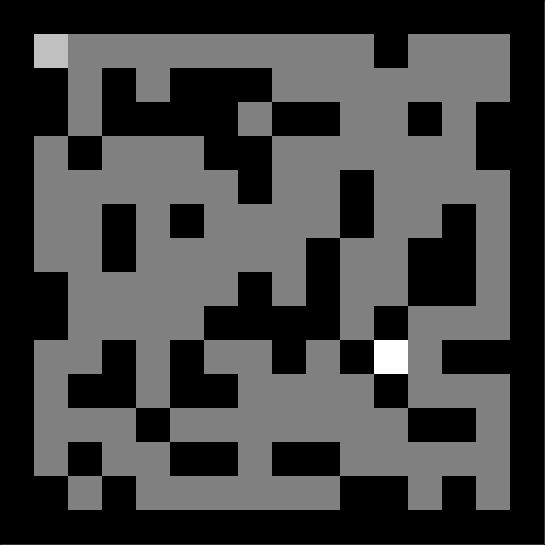
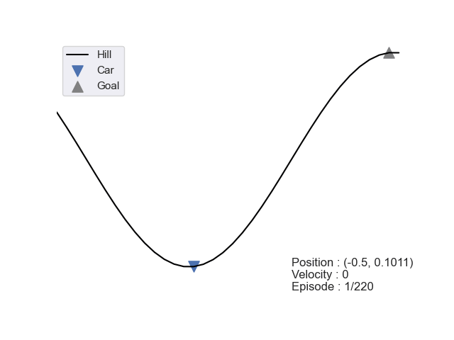

# Reinforcement Learning
## Overview
This repository provides an implementation of several reinforcement learning algorithms, must read papers/books and questions (of any kind).

  
  

In addition, I keep this repository updated with my thoughts and future work (mainly to answer the question: How to improve reinforcement learning for non-stationary environments).

## Report
A first report (available in [french](https://github.com/LounesMD/Stage2021_RL/blob/main/CompteRendu.pdf) or in [english]()) proposed an in-dept study of some of the algorithms used. Note that the algorithms are not written because they are easily found on the internet. For the first version of the report, my work was based on this document : [Reinforcement Learning](https://philippe-preux.github.io/Documents/digest-ar.pdf).

## To come

### <ins> Soon : </ins>
Fitted Q-Iteration.   
Deep Q-Learning.  

non-exhaustive list of what's coming soon : 
+ Algorithms :
  1. Fitted Q-Iteration
  2. Deep Q-Network
  3. REINFORCE
  4. PPO
  5. Quality-Diversity algorithms
+ Environment :
  1. Classic Control : Cart Pole and Acroboy.
  2. Mujoco : Ant, Hopper and Humanoid.
  3. My own environments !
 
Also, I would like to provide a script, based on Deep-Q Learning, that can be run on *every* video game website to find the best way to *maximize* a score.  
At the beginning of 2023, you will have an object-oriented implementation of my algorithms.  
During the first months of 2023, I will do my best to publish my answers to Richard S. Sutton's [book](http://incompleteideas.net/book/the-book.html) questions on a weekly basis (Before and after receiving the answers).  
I will also try to read more *theoretical articles* and articles on RL applied to robotics.
 
## To read
All the articles I've read and plan to read. I keep track of the teams involved so that I can get an idea of the research themes of RL teams around the world.  
I will soon deploy a link to my notes of some these articles.

  - [x] [Complexity of Planning with Partial Observability](https://www.aaai.org/Papers/ICAPS/2004/ICAPS04-041.pdf)  
    Teams involved : [Albert-Ludwigs-Universität Freiburg, Institut für Informatik](https://www.informatik.uni-freiburg.de/)
  - [ ] [An introduction to Reinforcement Learning](http://incompleteideas.net/book/bookdraft2017nov5.pdf) and its [video](https://www.youtube.com/watch?v=LyCpuLikLyQ&ab_channel=WeiWei)  
    Researchers involved : [Richard S. Sutton](http://incompleteideas.net/) and [Andrew G. Barto](https://people.cs.umass.edu/~barto/)
  - [x] [World Models](https://arxiv.org/pdf/1803.10122.pdf)  
    Teams involved : [Google Brain](https://research.google/teams/brain/), [NNAISENSE](https://nnaisense.com/) and [Swiss AI Lab, IDSIA](https://www.idsia.ch/)
  - [x] [Gans](https://arxiv.org/pdf/1406.2661.pdf) and [its analysis](https://www.youtube.com/watch?v=eyxmSmjmNS0&ab_channel=YannicKilcher)  
    Teams involved : [Université de Montreal](https://diro.umontreal.ca/accueil/)
  - [x] [Learn more about (finite) MDPs](http://incompleteideas.net/book/bookdraft2017nov5.pdf)  
    Researchers involved : [Richard S. Sutton](http://incompleteideas.net/) and [Andrew G. Barto](https://people.cs.umass.edu/~barto/)
  - [ ] [Offline Reinforcement Learning](https://arxiv.org/abs/2005.01643)
  - [x] [Outracing champion Gran Turismo drivers with deep reinforcement learning](https://www.nature.com/articles/s41586-021-04357-7)  
    Teams involved : [Sony AI](https://ai.sony/)
  - [x] [Hierarchical Reinforcement Learning for Precise Soccer Shooting Skills using a Quadrupedal Robot](https://arxiv.org/pdf/2208.01160.pdf)  
    Teams involved : [RAIL lab](http://rail.eecs.berkeley.edu/) and [MILA](https://mila.quebec/en/)
  - [ ] [AnyMorph: Learning Transferable Polices By Inferring Agent Morphology](https://arxiv.org/pdf/2206.12279.pdf)
  - [ ] [Human-level control through deep reinforcement learning](https://daiwk.github.io/assets/dqn.pdf)
  - [ ] [CONTINUOUS CONTROL WITH DEEP REINFORCEMENT LEARNING](https://arxiv.org/pdf/1509.02971.pdf?source=post_page---------------------------)
  - [ ] [Deep reinforcement learning with double q-learning](https://scholar.google.com/citationsview_op=view_citation&hl=en&user=-8DNE4UAAAAJ&citation_for_view=-8DNE4UAAAAJ:iH-uZ7U-co4C)
  - [ ] [The road to modern AI](https://arxiv.org/ftp/arxiv/papers/2212/2212.11279.pdf)
  - [ ] [UNSUPERVISED REPRESENTATION LEARNING WITH DEEP CONVOLUTIONAL GENERATIVE ADVERSARIAL NETWORKS](https://arxiv.org/pdf/1511.06434.pdf)
  - [ ] [TACTO: A Fast, Flexible, and Open-source Simulator for High-Resolution Vision-based Tactile Sensors](https://arxiv.org/pdf/2012.08456.pdf)
  - [ ] [In-Hand Object Rotation via Rapid Motor Adaptation](https://arxiv.org/pdf/2210.04887.pdf)
  - [ ] [Learning to Play Table Tennis From Scratch using Muscular Robots](https://arxiv.org/pdf/2006.05935.pdf)
  - [x] [Improving Intrinsic Exploration with Language Abstractions](https://arxiv.org/pdf/2202.08938.pdf)  
    Teams involved : [Stanford NLP Group](https://nlp.stanford.edu/), [Stanford AI Lab](https://ai.stanford.edu/), [Allen School's Natural Language Processing](https://www.cs.washington.edu/research/nlp) [META AI Researh](https://ai.facebook.com/), [DARK Lab](https://ucldark.com/) and [Cohere](https://cohere.ai/)
  - [x] [Exploration via Elliptical Episodic Bonuses](https://arxiv.org/pdf/2210.05805.pdf) and [OpenReview](https://openreview.net/forum?id=Xg-yZos9qJQ)  
  Teams involved : [META AI Researh](https://ai.facebook.com/) and [DARK Lab](https://ucldark.com/)
  - [ ] [MAESTRO: OPEN-ENDED ENVIRONMENT DESIGN FOR MULTI-AGENT REINFORCEMENT LEARNING](https://openreview.net/pdf?id=sKWlRDzPfd7)
  - [x] [Accelerated Quality-Diversity through Massive Parallelism](https://arxiv.org/pdf/2202.01258.pdf)  
    Teams involved : [Adaptive & Intelligent Robotics Lab](https://www.imperial.ac.uk/adaptive-intelligent-robotics/publications/) at the [Imperial College London](https://www.imperial.ac.uk/)
  - [ ] More ...

## Courses
Here are the courses I took to further my knowledge of Reinforcement Learning :
  - [ ] [An introduction to Reinforcement Learning](http://incompleteideas.net/book/bookdraft2017nov5.pdf) by [Richard S. Sutton](http://incompleteideas.net/) and [Andrew G. Barto](https://people.cs.umass.edu/~barto/)  
  - [x] [Reinforcement Learning](https://philippe-preux.github.io/Documents/digest-ar.pdf) by [Philippe Preux](https://philippe-preux.github.io/) 
  - [x] [Deep Learning for Computer Vision](https://www.youtube.com/watch?v=dJYGatp4SvA&list=PL5-TkQAfAZFbzxjBHtzdVCWE0Zbhomg7r&ab_channel=MichiganOnline) by [Justin Johnson](https://web.eecs.umich.edu/~justincj/)  
  - [x] Markov Chains by [Bruno Tuffin](https://people.rennes.inria.fr/Bruno.Tuffin/) and [Bruno Sericola](https://scholar.google.fr/citations?user=YOQcueAAAAAJ&hl=fr)  
  - [x] [Deep Learning with Python](https://sourestdeeds.github.io/pdf/Deep%20Learning%20with%20Python.pdf) by [François Chollet](https://fchollet.com/)

## Questions / Answers
### Questions
In this part, I will keep track of the questions I ask myself and publish their answers when I have the answer. I will do my best to publish them soon on stackoverflow, Quora, ... 
1. If we want to learn the optimal policy from the environnement (environnement we discover during exploration), why initialize the Quality function to 0 for each (state, action) at the beginning ? Should not we just add a value to (state,action) when we discover it ? (Generaly you'll see something like `Initialize Q(s,a) arbitrarily`)

2. A new way to encourage the exploration of the environnement is to give extra-rewards to the agent during its exploration*.
However, for various application, when the agent does something wrong and gets a negative reward, this negative reward is  exactly the same for the next epochs. My question is so : Why don't we just increase the negative reward ? (I don't say to get it to -inf, but make the agent thinks before doing the same errors several times). Maybe, by increasing the negative reward, in a non-linear way, with a strong increase close to the initial state can help.  
This is, from my point of view, different from the current approach wich is : The agent learns to don't do errors several times because it will learn to do no errors (by choosing the action that maximize its total reward).  
I'll try to implement this idea with the CarInTheHill problem and publish my results.  
*I'm still looking for the first article about this.

3. When we use an algorithm to find the optimal policy, let's say in go, do we use the same policy for both player (= and so update it by the score of both players) ? If yes, why do we think that the optimal policy found is optimal for the black payer and the white player ?  
Also, is it interesting to use different algorithms for the two players?

4. What is the difference between a bandit and an agent ? When to choose which one and can we oppose an agent and a bandit ?

5. How important it is to be able to know the new state of the agent after doing an action ? (Check this [article](https://www.aaai.org/Papers/ICAPS/2004/ICAPS04-041.pdf))

6. Let's say we want to train a robot to develop a policy that prevents it from falling when pushed into a wall. If we use a traditional reinforcement learning algorithm and consistently apply the same or similar force vectors during training, the robot will likely learn a single policy, such as using its right arm. How can we introduce diversity in the training data to encourage the robot to develop a variety of different policies, such as using its left arm, knees, or both arms, given the same initial state? Additionally, what does it mean when "two policies are similar" and how can we detect when the robot uses the same action, such as using its right arm, with different angles?

### Answers
1. I have done such an implementation for the mountain car problem, and the performance is the same. I asked this question before I realized that you can discretize your environment if you use a classic Q-Learning tabular method.

6. One solution to achieve a diverse set of policies is to use Quality-Diversity (QD) algorithms (check this [website](https://quality-diversity.github.io/) from Antoine Cully, Jean-Baptiste Mouret and Stephane Doncieux). To measure the similarity between two policies, we can represent them as vectors or use a spatial representation, and calculate the difference between these two vectors.
