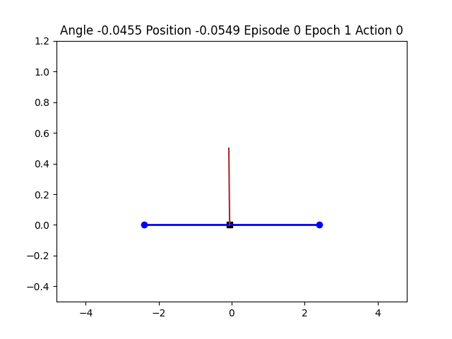
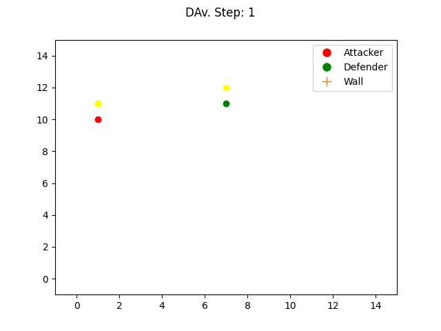

# Reinforcement Learning
## Overview
This repository provides an implementation of several reinforcement learning algorithms, must read papers/books and questions (of any kind).

  
  
  
  

In addition, I keep this repository updated with my thoughts and future work (mainly to answer the question: How to improve reinforcement learning for non-stationary environments). 
The long term goal of this repository is to be the must-have of GitHub Reinforcement Learning repository (RL Algo, environements, papers, etc).

## Report
A first report (available in [french](https://github.com/LounesMD/Stage2021_RL/blob/main/CompteRendu.pdf) and soon in [english]()) proposed an in-dept study of some of the algorithms used. Note that the algorithms are not written because they are easily found on the internet. For the first version of the report, my work was based on this document : [Reinforcement Learning](https://philippe-preux.github.io/Documents/digest-ar.pdf).

## To come
### <ins> Soon: </ins>
non-exhaustive list of what's coming soon: 
+ Algorithms:
  1. Deep Q-Network
  2. PPO
  3. Actor-Critic
+ Environment:
  1. My own environments
  
## Papers
All the articles I've read and plan to read. I keep track of the teams involved so that I can get an idea of the research themes of RL teams around the world.  
### Read
#### ML Related papers
  - [x] [Complexity of Planning with Partial Observability](https://www.aaai.org/Papers/ICAPS/2004/ICAPS04-041.pdf)  
    Teams involved : [Albert-Ludwigs-Universität Freiburg, Institut für Informatik](https://www.informatik.uni-freiburg.de/)
  - [x] [An introduction to Reinforcement Learning](http://incompleteideas.net/book/bookdraft2017nov5.pdf) and its [video](https://www.youtube.com/watch?v=LyCpuLikLyQ&ab_channel=WeiWei)  
    Researchers involved : [Richard S. Sutton](http://incompleteideas.net/) and [Andrew G. Barto](https://people.cs.umass.edu/~barto/)
  - [x] [World Models](https://arxiv.org/pdf/1803.10122.pdf)  
    Teams involved : [Google Brain](https://research.google/teams/brain/), [NNAISENSE](https://nnaisense.com/) and [Swiss AI Lab, IDSIA](https://www.idsia.ch/)
  - [x] [Gans](https://arxiv.org/pdf/1406.2661.pdf) and [its analysis](https://www.youtube.com/watch?v=eyxmSmjmNS0&ab_channel=YannicKilcher)  
    Teams involved : [Université de Montreal](https://diro.umontreal.ca/accueil/)
  - [x] [Learn more about (finite) MDPs](http://incompleteideas.net/book/bookdraft2017nov5.pdf)  
    Researchers involved : [Richard S. Sutton](http://incompleteideas.net/) and [Andrew G. Barto](https://people.cs.umass.edu/~barto/)
  - [x] [Outracing champion Gran Turismo drivers with deep reinforcement learning](https://www.nature.com/articles/s41586-021-04357-7)  
    Teams involved : [Sony AI](https://ai.sony/)
  - [x] [Hierarchical Reinforcement Learning for Precise Soccer Shooting Skills using a Quadrupedal Robot](https://arxiv.org/pdf/2208.01160.pdf)  
    Teams involved : [RAIL lab](http://rail.eecs.berkeley.edu/) and [MILA](https://mila.quebec/en/)
  - [x] [Improving Intrinsic Exploration with Language Abstractions](https://arxiv.org/pdf/2202.08938.pdf)  
    Teams involved : [Stanford NLP Group](https://nlp.stanford.edu/), [Stanford AI Lab](https://ai.stanford.edu/), [Allen School's Natural Language Processing](https://www.cs.washington.edu/research/nlp) [META AI Researh](https://ai.facebook.com/), [DARK Lab](https://ucldark.com/) and [Cohere](https://cohere.ai/)
  - [x] [Exploration via Elliptical Episodic Bonuses](https://arxiv.org/pdf/2210.05805.pdf) and [OpenReview](https://openreview.net/forum?id=Xg-yZos9qJQ)  
  Teams involved : [META AI Researh](https://ai.facebook.com/) and [DARK Lab](https://ucldark.com/)
  - [x] [Accelerated Quality-Diversity through Massive Parallelism](https://arxiv.org/pdf/2202.01258.pdf)  
    Teams involved : [Adaptive & Intelligent Robotics Lab](https://www.imperial.ac.uk/adaptive-intelligent-robotics/publications/) at the [Imperial College London](https://www.imperial.ac.uk/)
  - [x] [Discovering and Exploiting Sparse Rewards in a Learned Behavior Space](https://arxiv.org/pdf/2111.01919.pdf)  
    Teams involved : [AI Lab, SoftBank Robotics Europe](https://www.softbankrobotics.com/) and [Institut des Systémes Intelligents et de Robotique, ISIR](https://www.isir.upmc.fr/equipes/amac/)
  - [x] [Sparse Reward Exploration via Novelty Search and Emitters](https://arxiv.org/pdf/2102.03140.pdf)  
    Teams involved : [AI Lab, SoftBank Robotics Europe](https://www.softbankrobotics.com/) and [Institut des Systémes Intelligents et de Robotique, ISIR](https://www.isir.upmc.fr/equipes/amac/)
  - [x] [Emergence of Spatial Coordinates via Exploration](https://arxiv.org/pdf/2010.15469.pdf)  
    Team involved : [AI Lab, SoftBank Robotics Europe](https://www.softbankrobotics.com/)
  - [x] [Generalization in Cooperative Multi-Agent Systems](https://arxiv.org/pdf/2202.00104.pdf)  
    Team involved : [WhiRL](http://whirl.cs.ox.ac.uk/index.html) and [DARK Lab](https://ucldark.com/)
  - [x] [(MuZero) Mastering Atari, Go, chess and shogi by planning with a learned model📝](./WebPages/(MuZero)%20Mastering%20Atari%2C%20Go%2C%20chess%20and%20shogi%20by%20p%207bd57d21e0bf4b8fa23fad8842ded445.md)  
    Team involved : [DeepMind](https://deepmind.com/)
  - [x] [(AlphaZero) Mastering Chess and Shogi by Self-Play with a General Reinforcement Learning Algorithm📝](./WebPages/(AlphaZero)%20Mastering%20Chess%20and%20Shogi%20by%20Self-Play%206460966613664c28af351340322afdce.md)  
    Team involved : [DeepMind](https://deepmind.com/)
  - [x] [(AlphaGo Zero) Mastering the game of Go without human knowledge📝](./WebPages/(AlphaGO%20Zero)%20Mastering%20the%20game%20of%20Go%20without%20hu%20558133da88ee461b8107d36fddcf6ea0.md)  
    Team involved : [DeepMind](https://deepmind.com/)
  - [x] [(AlphaGO) Mastering the game of GO with deep neural networks and tree search📝](./WebPages/(AlphaGO)%20Mastering%20the%20game%20of%20GO%20with%20deep%20neura%20f71f9f55522545b58de0d7e1c0410492.md)  
    Team involved : [DeepMind](https://deepmind.com/)
  - [x] [(AlphaFold) Mastering the game of GO with deep neural networks and tree search📝](./WebPages/(AlphaGO)%20Mastering%20the%20game%20of%20GO%20with%20deep%20neura%20f71f9f55522545b58de0d7e1c0410492.md)  
    Team involved : [DeepMind](https://deepmind.com/)
  - [x] [(AlphaTensor) Discovering faster matrix multiplication algorithms with Reinforcement Learning📝](./WebPages/(AlphaTensor)%20Discovering%20faster%20matrix%20multiplica%206e5d564f0366440697a1de1fa4b2d2f6.md) 
    Team involved : [DeepMind](https://deepmind.com/)
  - [x] [(AlphaFold) Highly accurate protein structure prediction with AlphaFold📝](./WebPages/(AlphaFold)%20Highly%20accurate%20protein%20structure%20pred%20a6b0bd2932304666ae55f0a0aef1f220.md) 
    Team involved : [DeepMind](https://deepmind.com/)
  - [x] [(DeepNash) Mastering the Game of Stratego with Model-Free Multiagent Reinforcement Learning📝](./WebPages/(DeepNash)%20Mastering%20the%20game%20of%20Stratego%20with%20mod%20b064bddef212485db6f72bd3c67afd49.md) 
    Team involved : [DeepMind](https://deepmind.com/)
  - [x] [ETA Prediction with Graph Neural Networks in Google Maps📝](./WebPages/ETA%20Prediction%20with%20Graph%20Neural%20Networks%20in%20Googl%208403ba3951514491adcd478f930cefc6.md) 
    Team involved : [DeepMind](https://deepmind.com/), [Google](https://research.google/)
  - [x] [Reward is enough📝](./WebPages/Reward%20is%20enough%207124d06520804f9dab3525e2eb6550bb.md) 
    Team involved : [Google](https://research.google/)

#### Research oriented papers
  - [x] [Writing a research article: advice to beginners📝](./WebPages/Writing%20a%20research%20article%20advice%20to%20beginners%20684ac4664202472c85c481886be1049a.md) 
  - [ ] [How to do Research At the MIT AI Lab](https://dspace.mit.edu/bitstream/handle/1721.1/41487/AI_WP_316.pdf) 
  - [x] [Writing a Good Research Paper](https://vincentlepetit.github.io/files/paper_writing.pdf) by [Vincent Lepetit](https://vincentlepetit.github.io/) 
  - [x] How to write a great research paper: [Slides](https://www.microsoft.com/en-us/research/uploads/prod/2016/07/How-to-write-a-great-research-paper.pdf) and [Video](https://www.microsoft.com/en-us/research/academic-program/write-great-research-paper/) by [Simon Peyton Jones](https://simon.peytonjones.org/) 
  - [ ] How to give a great research talk: [Slides](https://www.microsoft.com/en-us/research/uploads/prod/2016/07/How-to-give-a-great-research-talk.pdf), [Video](https://www.microsoft.com/en-us/research/academic-program/give-great-research-talk/) and [Paper](https://www.microsoft.com/en-us/research/wp-content/uploads/2016/08/giving-a-talk.pdf) 

### To read
  - [ ] [Making the World Differentiable](https://people.idsia.ch/~juergen/FKI-126-90_(revised)bw_ocr.pdf)
  - [ ] [Player of Games](https://arxiv.org/abs/2112.03178)
  - [ ] [Approximate exploitability: Learning a best response in large games](https://arxiv.org/abs/2004.09677)
  - [ ] [Towards a Better Understanding of Representation Dynamics under TD-learning](https://arxiv.org/abs/2305.18491)
  - [ ] [MAESTRO: OPEN-ENDED ENVIRONMENT DESIGN FOR MULTI-AGENT REINFORCEMENT LEARNING](https://openreview.net/pdf?id=sKWlRDzPfd7)
  - [ ] [Deep reinforcement learning with double q-learning](https://scholar.google.com/citationsview_op=view_citation&hl=en&user=-8DNE4UAAAAJ&citation_for_view=-8DNE4UAAAAJ:iH-uZ7U-co4C)
  - [ ] [The road to modern AI](https://arxiv.org/ftp/arxiv/papers/2212/2212.11279.pdf)

## Courses
Here are the courses I took to further my knowledge of Reinforcement Learning:
  - [ ] [Reinforcement Learning - MVA](http://researchers.lille.inria.fr/~lazaric/Webpage/Teaching.html) by [Alessandro Lazaric](http://researchers.lille.inria.fr/~lazaric/Webpage/Home/Home.html) 
  - [x] [Reinforcement Learning - Scool](https://philippe-preux.github.io/Documents/digest-ar.pdf) by [Philippe Preux](https://philippe-preux.github.io/) 
  - [x] [Game Theory and Applications](https://www.dropbox.com/s/lkbqe5i3wgc3on3/support.pdf?dl=0) by [Bruno Tuffin](https://people.rennes.inria.fr/Bruno.Tuffin/) and [Patrick Maillé](https://www.imt-atlantique.fr/fr/personne/patrick-maille)  
  - [x] Markov Chains by [Bruno Tuffin](https://people.rennes.inria.fr/Bruno.Tuffin/) and [Bruno Sericola](https://scholar.google.fr/citations?user=YOQcueAAAAAJ&hl=fr)  
  - [x] [Deep Learning with Python](https://sourestdeeds.github.io/pdf/Deep%20Learning%20with%20Python.pdf) by [François Chollet](https://fchollet.com/)
  - [x] [Deep Learning for Computer Vision](https://www.youtube.com/watch?v=dJYGatp4SvA&list=PL5-TkQAfAZFbzxjBHtzdVCWE0Zbhomg7r&ab_channel=MichiganOnline) by [Justin Johnson](https://web.eecs.umich.edu/~justincj/)  

## Books
Here are some books that I read or plan to read:
  - [ ] [Mathematics of Statistical Sequential Decision Making](https://hal.science/tel-02162189) by [Odalric-Ambrym Maillard](http://odalricambrymmaillard.neowordpress.fr/) 
  - [ ] [Statistical Learning and Sequential Prediction](https://www.mit.edu/~rakhlin/courses/stat928/stat928_notes.pdf) by [Karthik Sridharan](https://www.cs.cornell.edu/~sridharan/) and [Sasha Rakhlin](https://www.mit.edu/~rakhlin/)
  - [ ] [Algorithms for decision making](https://algorithmsbook.com/#outline) by [Mykel J. Kochenderfer](https://mykel.kochenderfer.com/), [Tim A. Wheeler](http://timallanwheeler.com/miniport/home.html) and [Kyle H. Wray](https://kylewray.com/)
  - [ ] [Multi-Agent Reinforcement Learning: Foundations and Modern Approaches](https://www.marl-book.com/) by [Stefano V. Albrecht](https://agents.inf.ed.ac.uk/stefano-albrecht/), [Filippos Christianos](https://fchristianos.com/) and [Lukas Schäfer](https://www.marl-book.com/)  
  - [x] [An introduction to Reinforcement Learning](http://incompleteideas.net/book/bookdraft2017nov5.pdf) by [Richard S. Sutton](http://incompleteideas.net/) and [Andrew G. Barto](https://people.cs.umass.edu/~barto/)  
  - [ ] [Software Engineering at Google](https://abseil.io/resources/swe-book) and the book in short [SWE at Google in short](https://arxiv.org/ftp/arxiv/papers/1702/1702.01715.pdf)

## Blogs and Videos
Here are some blogs, videos or webpages that I found interseting:
  - [x] [CONFERENCE JENSEN HUANG (NVIDIA) and ILYA SUTSKEVER (OPEN AI): AI TODAY AND VISION OF THE FUTURE📝](./WebPages/Discussion%20Ilya%20x%20Jensen%2073db3112e6e34b4896dc9b97cc9ae961.md) by [Ilya Sutskever](https://www.cs.utoronto.ca/~ilya/) and [Jensen Huang](https://www.nvidia.com/fr-fr/) 
  - [ ] [Quality-Diversity optimisation algorithms](https://quality-diversity.github.io/) by [Antoine Cully](https://scholar.google.fr/citations?user=rZtJlPQAAAAJ&hl=fr), [Jean-Baptiste Mouret](https://members.loria.fr/JBMouret/) and [Stephane Doncieux](https://pages.isir.upmc.fr/sdoncieux/) 
  - [x] [I am Jürgen Schmidhuber, Ask Me Anything!](https://www.reddit.com/r/MachineLearning/comments/2xcyrl/i_am_j%C3%BCrgen_schmidhuber_ama/) by [Jürgen Schmidhuber](https://people.idsia.ch/~juergen/) 

